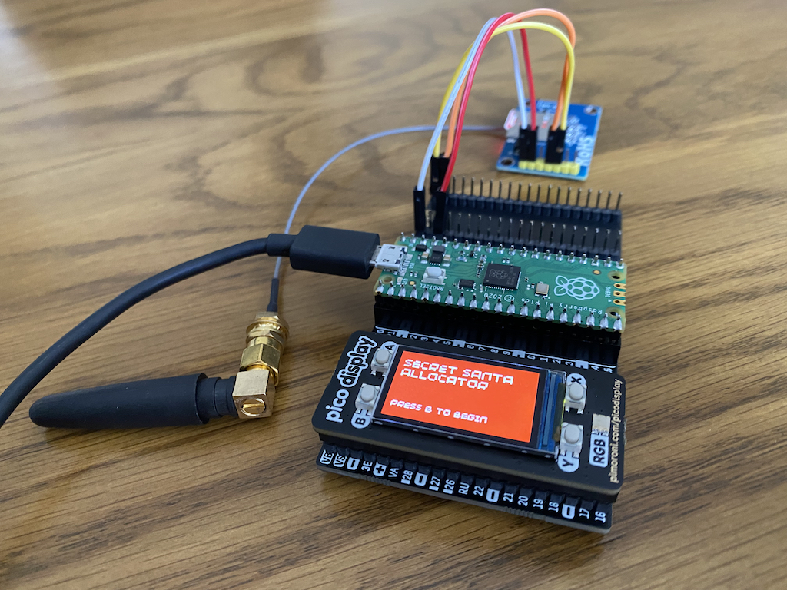
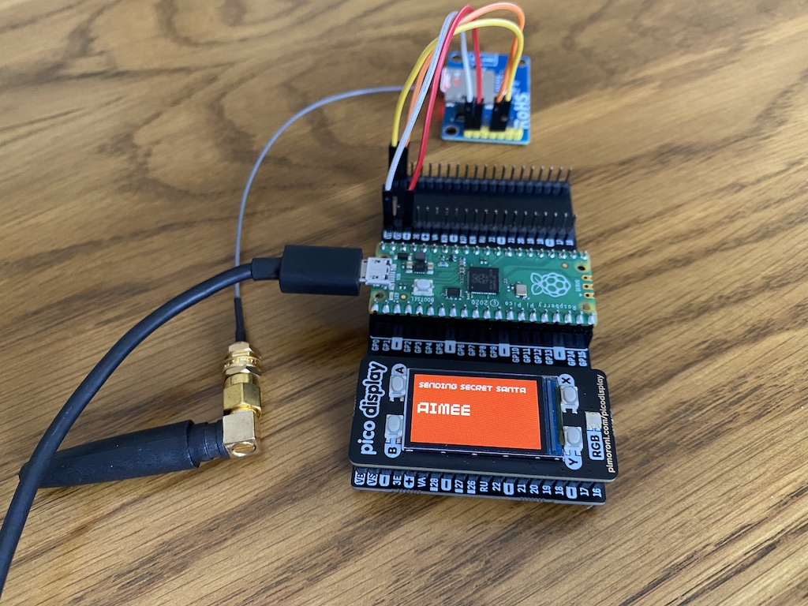
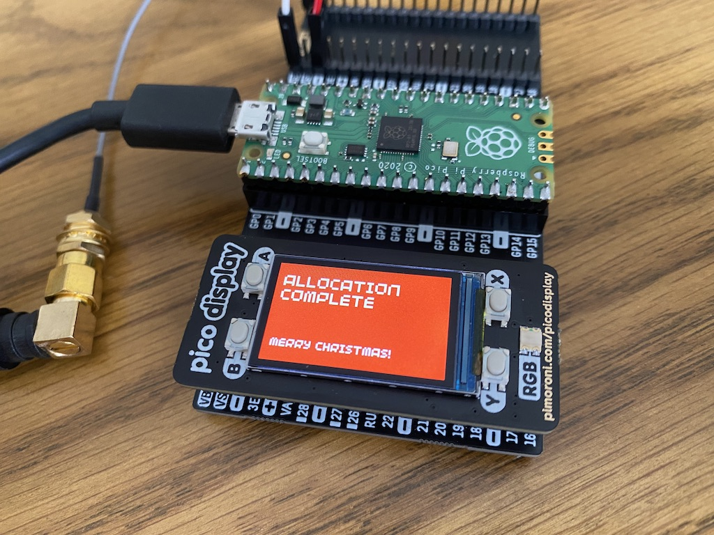

# Pico Secret Santa

Allocates and sends an SMS to every Secret Santa participant; using MicroPython, Raspberry Pi Pico, a [SIM800L module](https://lastminuteengineers.com/sim800l-gsm-module-arduino-tutorial/) and the [Pico Display Pack](https://shop.pimoroni.com/products/pico-display-pack).

  

## Usage

- Connect the [Pico Display Pack](https://shop.pimoroni.com/products/pico-display-pack) to the Raspberry Pi Pico.
- Connect the [SIM800L module](https://lastminuteengineers.com/sim800l-gsm-module-arduino-tutorial/) to the Raspberry Pi Pico.
- Create a `participants.json` file (based on `participants.json.example`) which includes the desired participants.
- Flash the Raspberry Pi Pico with the latest [MicroPython with Pimoroni Libs](https://github.com/pimoroni/pimoroni-pico/releases/latest).
- Copy the codebase to the Raspberry Pi Pico.
- Boot the Raspberry Pi Pico and follow the on-screen instructions.

## Other Years

Interested in seeing how I over-engineered the problem of allocating Secret Santa's in other years?

- 2020 - [Clojure Secret Santa](https://github.com/eddmann/clojure-secret-santa)
- 2021 - [Pico Secret Santa](https://github.com/eddmann/pico-secret-santa)
- 2022 - [Step Function Secret Santa](https://github.com/eddmann/step-function-secret-santa)
